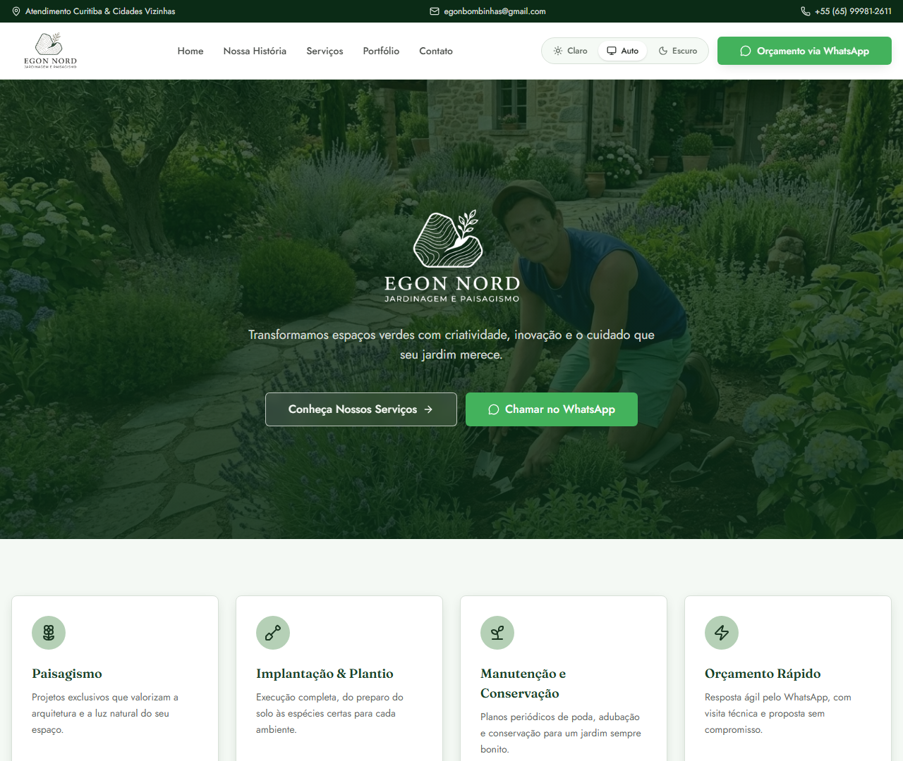

# Egon Nord — Jardinagem & Paisagismo

Site institucional da Egon Nord, empresa de jardinagem e paisagismo com atendimento em Curitiba e região.

Site em produção: [egonnord.com.br](https://egonnord.com.br)

Desenvolvido por **HighTech Tecnologia**.



## Desenvolvimento local

Requer Node.js e npm.

```sh
npm install
npm run dev
```

## Scripts disponíveis

- `npm run dev` — servidor de desenvolvimento
- `npm run build` — build de produção padrão (Cloudflare Workers)
- `npm run build:hostinger` — gera uma build 100% estática, pronta para hospedagem sem Node/Workers (Hostinger)
- `npm run deploy:hostinger` — publica a build estática no servidor da Hostinger via SSH (com backup automático da versão anterior)
- `npm run lint` / `npm run format` — checagem e formatação de código

O deploy para a Hostinger requer a chave SSH do projeto configurada em `~/.ssh/config` com o host `egon-nord-hostinger`. Detalhes em `scripts/build-hostinger.py` e `scripts/deploy-hostinger.py`.

## Stack

- TanStack Start
- TypeScript
- React
- Tailwind CSS
